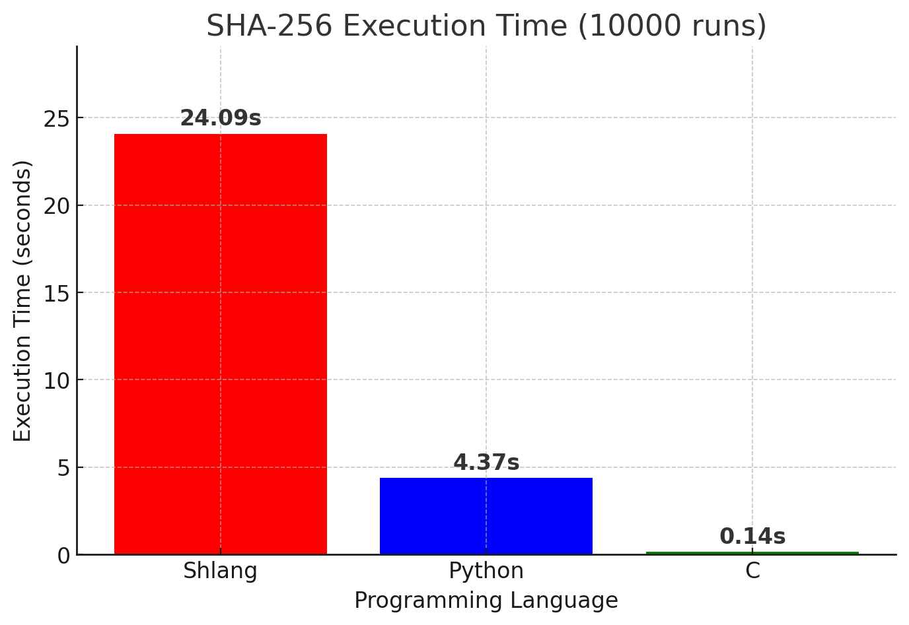

<p align="center">
  
</p>

# Overview

Shlang is an **interpreted programming language** with a **static type checker** and **reference counting**. I started this project as part of the *100 Commits* challenge organized by DevMentors. 
The goal of the event was to learn something new while making one commit every day for 100 days. I decided to create a programming language that could be used for the next Advent of Code. Unfortunately, time passed, and I got busy, so I wasn't able to finish it in time.  

I started developing **Shlang** while reading the book *Crafting Interpreters*. My code is based on it, but I added several features and changes, such as a static type checker, reference counting instead of a garbage collector, break and continue statements, recursion, file importing, and more.  


# Examples

Shlang's syntax is inspired by Rust and Python.  

## Hello world
```
fn main() {
  println("Hello world")
}
```

## Fizzbuzz
```
fn main() {
    for i in (1,100) {
        if i % 15 == 0 {
            println("Fizz Buzz")
        }elif i % 5 == 0 {
            println("Buzz")
        }elif i % 3 == 0 {
            println("Fizz")
        }else {
            println(i)
        }
    }
}
```
<br>
More examples can be found in the examples and test folders.

# Usage

Currently, the only way to run Shlang is to compile it from source using Cargo:  
```sh
git clone https://github.com/GNUSheep/shlang.git
cd shlang
cargo build --release
./target/release/shlang
```

# Benchmark

I implemented a **SHA-256** benchmark to compare my language against **Python** and **C**. The benchmark runs the SHA-256 algorithm 10,000 times on my laptop.  
- **Specs:** AMD Ryzen 3 3250U with 6GB of RAM 

<p align="center">
  
</p>

<br>

As expected, I didn't put much effort into optimizing it. The only optimization I made was using **Valgrind** to analyze performance bottlenecks and see if any improvements were possible.

# Future

**I plan to use this language to complete Advent of Code 2025.**  

There are many features I would like to implement (for example, adding a split function for strings to return a List of Strings). I will continue developing this project in my free time.  
